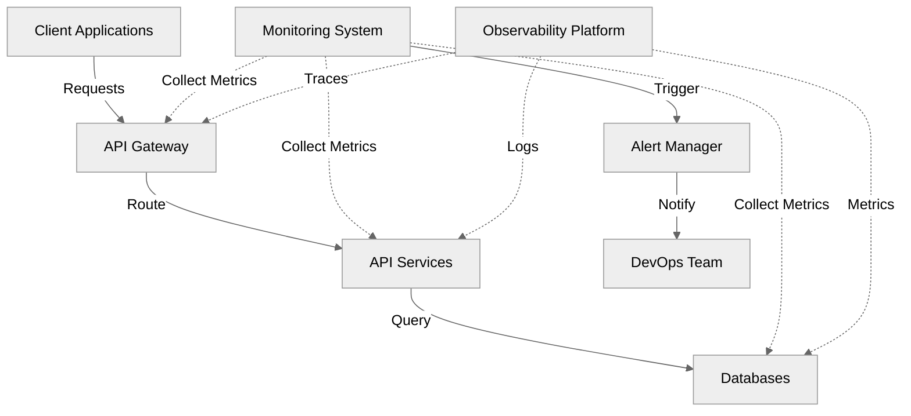
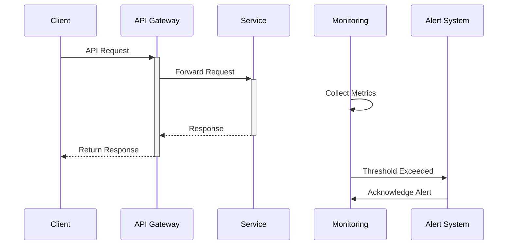
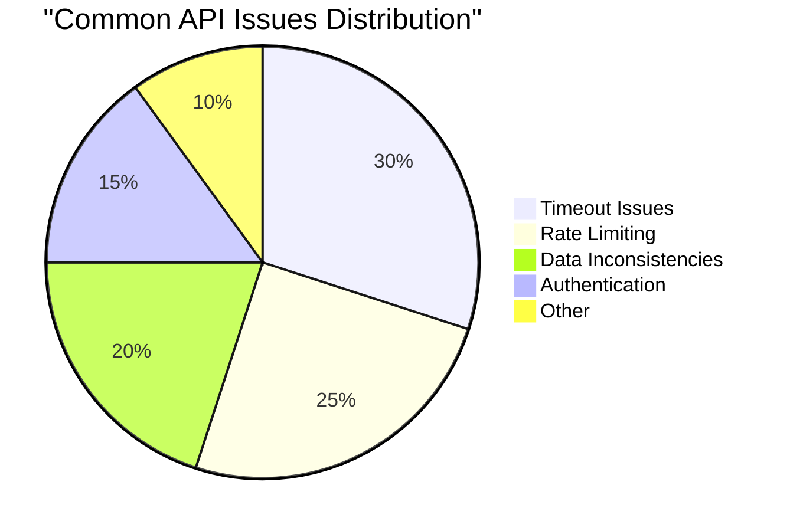
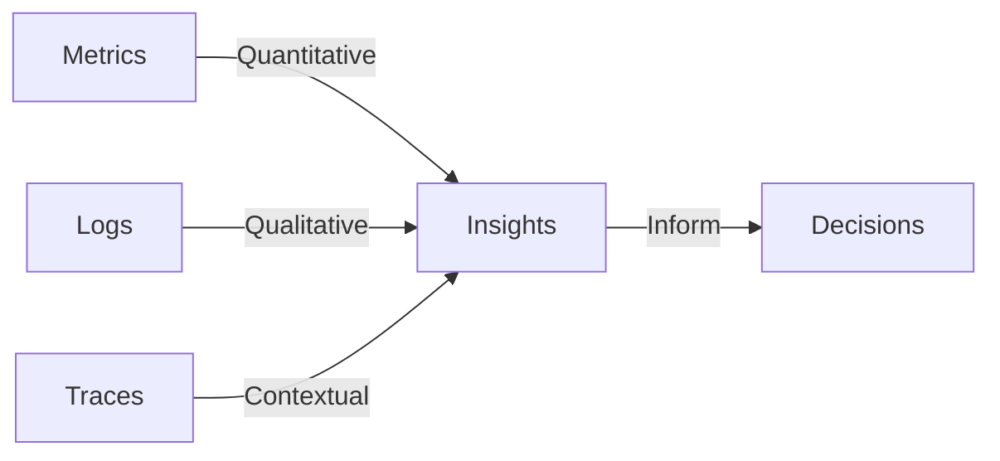
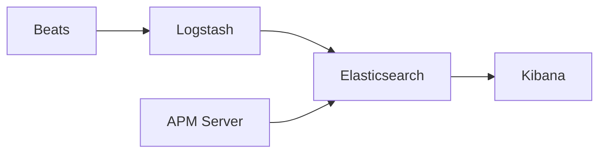

# Elevating API Resilience and Performance

## Advanced Monitoring and Observability

<div class="pt-12">
  <span class="text-xl">
    Luqman
    <div class="text-sm opacity-50">DevOps Engineer</div>
  </span>
</div>

<div class="abs-br m-6 flex gap-2">
  <a href="https://lu.ma/92yp3ytk" target="_blank" 
    class="text-xl opacity-50 !border-none !hover:text-white">
    API Connect
  </a>
</div>

---
layout: intro
---

# Setting the Stage

<v-clicks>

- 83% of web traffic is API traffic
- Average enterprise uses 900+ applications
- Critical business operations depend on APIs
- Modern challenges require modern solutions

</v-clicks>

---
layout: default
---

# API Ecosystem Overview



---
layout: default
---

# Request Flow & Monitoring



---
layout: default
---

# Common API Issues Distribution



---
layout: default
---

# Three Pillars of Observability



---
layout: default
---

# Live Monitoring Demo

<div class="w-full flex justify-center">
  <APIMonitoringDemo />
</div>

---
layout: section
---

# Today's Journey

<v-clicks>

1. Understanding API Resilience
2. Deep Dive into Monitoring Strategies
3. Implementing Comprehensive Observability
4. Real-world Examples & Best Practices
5. Interactive Discussion

</v-clicks>

---
layout: two-cols
---

# What is API Resilience?

::left::

<v-clicks>

## Key Aspects
- Fault tolerance
- Self-healing capabilities
- Graceful degradation
- Recovery mechanisms

</v-clicks>

::right::

<v-clicks>

## Common Failure Patterns
- Network failures
- Rate limiting issues
- Database problems
- Memory leaks
- Cascading failures
- Dependency issues

</v-clicks>

---
layout: default
---

# Impact of Poor API Performance

<div grid="~ cols-2 gap-4">
<div>

## Business Impact
<v-clicks>

- Revenue loss
- Customer dissatisfaction
- Brand damage
- Lost opportunities

</v-clicks>

</div>
<div>

## Technical Impact
<v-clicks>

- System instability
- Data inconsistency
- Resource wastage
- Increased technical debt

</v-clicks>

</div>
</div>

---
layout: section
---

# Advanced Monitoring Strategies

<v-clicks>

## The Foundation
- Latency
- Error rates
- Throughput
- Saturation
- Resource utilization

</v-clicks>

---
layout: two-cols
---

# Modern Monitoring Stack

::left::

## Datadog & NewRelic
<v-clicks>

- Real-time performance monitoring
- APM capabilities
- Infrastructure monitoring
- Custom metrics
- Transaction tracing
- Error tracking

</v-clicks>

::right::

## Prometheus & Grafana
<v-clicks>

- Time-series data collection
- Custom metrics
- Alerting capabilities
- Visualization excellence
- PromQL flexibility
- Dashboard templates

</v-clicks>

---
layout: default
---

# Elastic Stack Deep Dive



<v-clicks>

- Log aggregation and analysis
- Full-text search capabilities
- Anomaly detection
- Visual data exploration
- Real-time monitoring
- Custom dashboards

</v-clicks>

---
layout: two-cols
---

# PostHog Integration

::left::

<v-clicks>

## Analytics Features
- User behavior tracking
- Feature flag management
- Session recording
- Product analytics
- A/B testing

</v-clicks>

::right::

<v-clicks>

## Benefits
- Data-driven decisions
- User-centric monitoring
- Feature impact analysis
- Conversion tracking
- Engagement metrics

</v-clicks>

---
layout: default
---

# Implementation Best Practices

<v-clicks>

1. **Start with Business Objectives**
   - Define clear goals
   - Align with stakeholders
   - Set measurable targets

2. **Define Standards**
   - SLIs (Service Level Indicators)
   - SLOs (Service Level Objectives)
   - SLAs (Service Level Agreements)

3. **Technical Implementation**
   - Proper tagging strategy
   - Meaningful dashboards
   - Intelligent alerting
   - Automation

</v-clicks>

---
layout: default
---

# Real-World Implementation

```yaml {all|2-8|9-15|16-20|all}
monitoring:
  # Prometheus Alert Configuration
  alerts:
    - name: "HighErrorRate"
      condition: "error_rate > 0.05"
      duration: "5m"
      severity: "critical"
      action: "page_oncall"
  # APM Configuration
  apm:
    datadog:
      sampling_rate: 0.5
      env: "production"
      service_mapping: true
  # Logging Strategy
  logging:
    structured: true
    retention: "30d"
    indexing: "daily"
```

---
layout: two-cols
---

# Advanced Concepts

::left::

## Proactive Monitoring
<v-clicks>

- Synthetic monitoring
- Load testing
- Chaos engineering
- Predictive analytics
- Automated testing

</v-clicks>

::right::

## Future-Proofing
<v-clicks>

- AI/ML integration
- Automated root cause analysis
- Self-healing systems
- Predictive scaling
- Continuous optimization

</v-clicks>

---
layout: default
---

# Implementation Roadmap

<v-clicks>

1. **Assessment Phase**
   - Current state analysis
   - Gap identification
   - Tool evaluation

2. **Strategy Development**
   - Monitoring plan
   - Tool selection
   - Resource allocation

3. **Implementation**
   - Phased rollout
   - Team training
   - Documentation

4. **Optimization**
   - Performance tuning
   - Alert refinement
   - Continuous improvement

</v-clicks>

---
layout: center
class: text-center
---

# Q&A

Let's discuss your questions!

<div class="pt-8">
  <span class="px-2 py-1">
    Common Topics:
    - Tool selection criteria
    - Cost implications
    - Alert management
    - Legacy system integration
    - ROI measurement
  </span>
</div>

---
layout: end
---

# Thank You!

<div class="pt-12">
  <span @click="$slidev.nav.next" class="px-2 py-1 rounded cursor-pointer" hover="bg-white bg-opacity-10">
    Resources and Documentation Available
  </span>
</div>

<div class="abs-br m-6 flex gap-2">
  <a href="https://lu.ma/92yp3ytk" target="_blank" 
    class="text-xl opacity-50 !border-none !hover:text-white">
    API Connect
  </a>
</div>