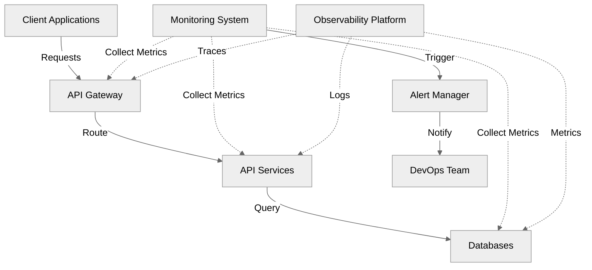
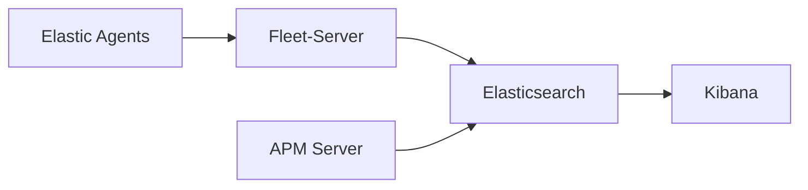

# Elevating API Resilience and Performance

## Advanced Monitoring and Observability

<div class="grid grid-cols-[3fr,2fr]">
<div>
  <div class="pt-12">
    <span class="text-xl">
      Luqman
      <div class="text-sm opacity-50">DevOps Engineer</div>
    </span>
  </div>
</div>
<div class="flex items-center justify-center">
  
</div>
</div>

<div class="abs-br m-6 flex gap-2">
  <a href="https://lu.ma/92yp3ytk" target="_blank" 
    class="text-xl opacity-50 !border-none !hover:text-white">
    API Connect
  </a>
</div>

<!--
  Welcome everyone! I'm excited to share insights about API resilience and monitoring.
  This presentation will cover both theoretical concepts and practical implementations.
-->

---
layout: default
---

# Setting the Stage

<div class="grid grid-cols-2 gap-4">
<div>

<v-clicks>

- 83% of web traffic is API traffic
- Average enterprise uses 900+ applications
- Critical business operations depend on APIs
- Modern challenges require modern solutions

</v-clicks>

</div>
<div class="flex items-center justify-center">
  
</div>
</div>
<!--
  Understanding the API ecosystem is crucial for implementing effective monitoring.
  Let's look at how different components interact with each other.
-->

---
layout: default
---

# Why This Matters

<div grid="~ cols-2 gap-4">
<div>

## Business Impact
<v-clicks>

- Revenue loss from downtime
- Customer satisfaction
- Brand reputation
- Market competitiveness

</v-clicks>

</div>
<div>

## Technical Impact
<v-clicks>

- System reliability
- Performance bottlenecks
- Resource utilization
- Developer productivity

</v-clicks>

</div>
</div>

---
layout: default
---

# API Ecosystem Overview



---
layout: default
---

# Current Monitoring Challenges

<div grid="~ cols-2 gap-4">
<div>

## Scale Issues
<v-clicks>

- Microservices complexity
- Container orchestration
- Multi-cloud deployments
- Dynamic scaling

</v-clicks>

</div>
<div>

## Operational Challenges
<v-clicks>

- Alert fatigue
- Root cause analysis
- Service dependencies
- Resource optimization

</v-clicks>

</div>
</div>

---
layout: default
---

# Modern Monitoring Stack

<div grid="~ cols-2 gap-4">
<div>

## Datadog & NewRelic
<v-clicks>

- Real-time performance monitoring
- APM capabilities
- Infrastructure monitoring
- Custom metrics
- Transaction tracing
- Error tracking

</v-clicks>

</div>
<div>

## Prometheus & Grafana
<v-clicks>

- Time-series data collection
- Custom metrics
- Alerting capabilities
- Visualization excellence
- PromQL flexibility
- Dashboard templates
- Open-source community

</v-clicks>

</div>
</div>

<!--
Testing
-->

---
layout: default
---

# Elastic Stack Deep Dive



<v-clicks>

- Log aggregation and analysis
- Full-text search capabilities
- Anomaly detection
- Visual data exploration
- Real-time monitoring
- Custom dashboards

</v-clicks>

---
layout: default
---

# PostHog Integration

<div grid="~ cols-2 gap-4">
<div>

<v-clicks>

## Analytics Features
- User behavior tracking
- Feature flag management
- Session recording
- Product analytics
- A/B testing

</v-clicks>

</div>
<div>

<v-clicks>

## Benefits
- Data-driven decisions
- User-centric monitoring
- Feature impact analysis
- Conversion tracking
- Engagement metrics

</v-clicks>
</div>
</div>

---
layout: default
---

# Live Monitoring Demo

<div class="w-full flex justify-center">
  <APIMonitoringDemo />
</div>

---
layout: two-cols
---

# API Resilience Patterns


## Circuit Breakers
<v-clicks>

- Prevents cascade failures
- Auto-recovery
- Custom fallback strategies
- Health monitoring

</v-clicks>

::right::

## Implementation
```java
@CircuitBreaker(name = "userService",
    fallbackMethod = "userFallback",
    slidingWindowSize = 10,
    failureRateThreshold = 50,
    waitDurationInOpenState = 5000)
public User getUser(String id) {
    return userService.getUser(id);
}
```

---
layout: default
---

# Rate Limiting Strategies

```yaml
# API Gateway Configuration
rate-limiting:
  # Token Bucket Algorithm
  algorithms:
    token-bucket:
      rate: 100
      burst: 20
      replenish-rate: 10

  # Redis Implementation
  redis:
    host: redis-master
    port: 6379
    timeout: 2000

  # Response Headers
  headers:
    remaining: X-RateLimit-Remaining
    reset: X-RateLimit-Reset
    limit: X-RateLimit-Limit
```

---
layout: two-cols
---

# Implementation Best Practices


## Core Principles
<v-clicks>

1. **Start with Objectives**
   - Define clear goals
   - Align with stakeholders
   - Set measurable targets

2. **Define Standards**
   - SLIs (Service Level Indicators)
   - SLOs (Service Level Objectives)
   - SLAs (Service Level Agreements)

</v-clicks>

::right::

## Technical Approach
<v-clicks>

1. **Implementation Steps**
   - Proper tagging strategy
   - Meaningful dashboards
   - Intelligent alerting
   - Automation first

2. **Validation Process**
   - Performance testing
   - Chaos engineering
   - Continuous validation
   - Feedback loops

</v-clicks>

---
layout: default
---

# DevOps Integration

```yaml
# ArgoCD Application Configuration
apiVersion: argoproj.io/v1alpha1
kind: Application
metadata:
  name: monitoring-stack
spec:
  source:
    repoURL: https://github.com/org/monitoring
    path: kubernetes
    targetRevision: HEAD
  destination:
    server: https://kubernetes.default.svc
    namespace: monitoring
```

---
layout: default
---

# Kubernetes Monitoring Setup

```yaml
# Prometheus Operator
apiVersion: monitoring.coreos.com/v1
kind: ServiceMonitor
metadata:
  name: api-monitor
spec:
  selector:
    matchLabels:
      app: api-service
  endpoints:
  - port: http
    path: /metrics
    interval: 15s
    scrapeTimeout: 14s
    metricRelabelings:
    - sourceLabels: [__name__]
      regex: 'http_requests_total'
      action: keep
```

---
layout: default
---

# Alert Management

```yaml
groups:
- name: api.rules
  rules:
  - alert: HighErrorRate
    expr: |
      sum(rate(http_requests_total{status=~"5.."}[5m])) 
      / 
      sum(rate(http_requests_total[5m])) > 0.05
    for: 5m
    labels:
      severity: critical
    annotations:
      summary: High API Error Rate
      description: "Error rate is {{ $value }}%"
      runbook_url: "https://wiki.org/runbooks/high-error-rate"
```

---
layout: default
---

# Real-World Case Study

<div grid="~ cols-2 gap-4">
<div>

## Initial State
- 99.5% availability
- 500ms response time
- 1% error rate
- Manual scaling

</div>
<div>

## After Implementation
- 99.99% availability
- 150ms response time
- 0.1% error rate
- Auto-scaling enabled

</div>
</div>

<v-clicks>

## Key Learnings
- Importance of baseline metrics
- Value of automated responses
- Need for proper monitoring
- Cost vs. performance balance

</v-clicks>

---
layout: default
---

# Auto-scaling Configuration

```yaml
# Horizontal Pod Autoscaling
apiVersion: autoscaling/v2
kind: HorizontalPodAutoscaler
metadata:
  name: api-hpa
spec:
  scaleTargetRef:
    apiVersion: apps/v1
    kind: Deployment
    name: api-service
  minReplicas: 3
  maxReplicas: 10
  metrics:
  - type: Resource
    resource:
      name: cpu
      target:
        type: Utilization
        averageUtilization: 70
```

---
layout: section
---

# Incident Response & SRE Practices

<v-clicks>

1. Automated Remediation
2. Runbook Automation
3. Post-Mortem Process
4. SLO/SLI Management
5. Error Budget Policy

</v-clicks>

---
layout: default
---

# Automated Remediation

```python
def auto_remediate(incident):
    if incident.type == "HighLatency":
        # Scale up resources
        scale_deployment(
            namespace="production",
            deployment="api-service",
            replicas="+2"
        )
    elif incident.type == "HighErrorRate":
        # Implement circuit breaker
        enable_circuit_breaker(
            service="affected-service",
            threshold=0.5,
            timeout="30s"
        )
```

---
layout: two-cols
---

# Business Impact Analysis


## Cost Metrics
<v-clicks>

- Infrastructure costs
- Tool licensing
- Operation overhead
- Incident impact

</v-clicks>

::right::

## ROI Indicators
<v-clicks>

- Reduced MTTR
- Improved availability
- Customer satisfaction
- Resource efficiency

</v-clicks>

---
layout: center
class: text-center
---

# Q&A

Let's discuss your questions!

<div class="pt-8">
  <span class="px-2 py-1">
    Common Topics:
    - Tool selection strategy
    - Cost optimization
    - Scale challenges
    - Integration patterns
    - Team collaboration
  </span>
</div>

---
layout: end
---

# Thank You!

<div class="pt-12">
  <span @click="$slidev.nav.next" class="px-2 py-1 rounded cursor-pointer" hover="bg-white bg-opacity-10">
    Resources and Documentation Available
    - GitHub Repo: example/api-monitoring
    - Documentation: docs.example.com
    - Contact: @luqman
  </span>
</div>

<div class="abs-br m-6 flex gap-2">
  <a href="https://lu.ma/92yp3ytk" target="_blank" 
    class="text-xl opacity-50 !border-none !hover:text-white">
    API Connect
  </a>
</div>
