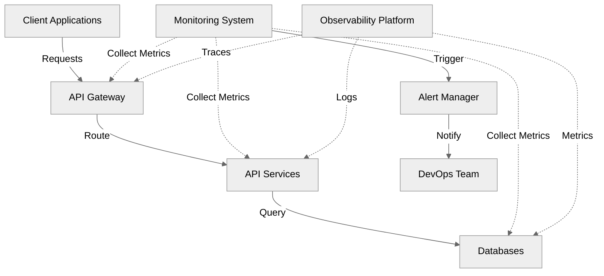
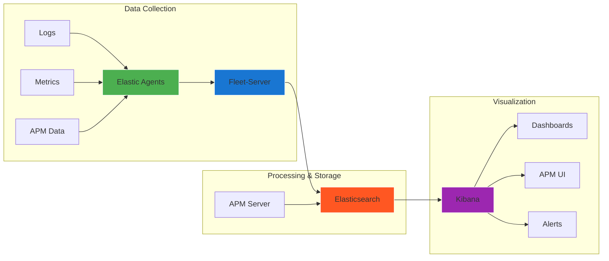
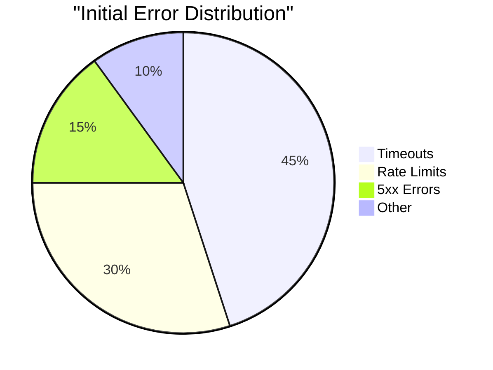

# Elevating API Resilience and Performance

## Advanced Monitoring and Observability

<!-- <div class="flex items-center justify-center">
  
</div> -->

<div class="abs-br m-6 flex gap-12">
  <a href="https://lu.ma/92yp3ytk" target="_blank" 
    class="text-xl opacity-50 !border-none !hover:text-white">
    API Connect
  </a>
</div>

<!--
Hello everyone! 

I'm Luqman Bello, a Senior DevOps Engineer at OpenBB with over 7 years of experience in IT Industry. 

Today's presentation draws from my experience in:
- Building and maintaining high-performance API infrastructures
- Implementing monitoring solutions at scale
- DevOps automation and tooling
- Cloud-native architectures

I've designed this session to be interactive and practical, focusing on real-world implementations and solutions. Feel free to ask questions throughout the presentation.

Key areas we'll explore:
- Modern API monitoring challenges
- Advanced observability techniques
- Implementation strategies
- Best practices from the field
-->

---
layout: text-image
media: "https://media.giphy.com/media/3oKIPEqDGUULpEU0aQ/giphy.gif"
---

# Setting the Stage

<v-clicks>

🌐 83% of web traffic is API traffic

🏢 Average enterprise uses 900+ applications

⚠️ $100K+ per hour of API downtime cost

🎯 200% annual increase in API security incidents

🔄 75% of organizations prioritize API monitoring

</v-clicks>

<v-clicks>

<div class="mt-4 text-sm text-gray-400">
Sources: Akamai, Salt Security Report 2023
</div>

</v-clicks>

<!--
Let me set the context for today's discussion:

- The 83% figure shows how APIs have become the backbone of modern digital infrastructure
- With 900+ applications in an average enterprise, the complexity of monitoring has increased exponentially
- Downtime costs aren't just financial - they impact reputation and customer trust
- Security incidents highlight the need for comprehensive monitoring
- Organizations are recognizing the critical nature of API monitoring

[The GIF on the right shows a dynamic visualization of network traffic, representing the complex nature of API interactions in modern systems]
-->

---
layout: default
---

# Why This Matters

<div grid="~ cols-2 gap-4">
<div>

<v-clicks>

## Business Impact

</v-clicks>

<v-clicks>

💰 Revenue loss from downtime: ~$100K+ per hour for large enterprises

😊 Customer satisfaction: ~84% abandon apps after poor experience

🏢 Brand reputation: ~60% switch providers after outage

🎯 Market competitiveness: ~3x faster time-to-market with reliable APIs

</v-clicks>

</div>
<div>

<v-clicks>

## Technical Impact
</v-clicks>

<v-clicks>

🔄 System reliability: ~99.9% uptime requirement

⚡ Performance bottlenecks: ~Sub-second response times

📊 Resource utilization: ~Optimal cost-performance ratio

👩‍💻 Developer productivity: ~30% time saved with proper monitoring

</v-clicks>

</div>
</div>

<!--
This slide illustrates the dual impact of API performance:

Business Impact:
- Downtime directly affects revenue - companies lose an average of $100,000 per hour
- Customer satisfaction is closely tied to API performance
- Brand reputation can take months to recover after significant outages
- Market leaders consistently demonstrate better API reliability

Technical Impact:
- Modern systems require high availability and reliability
- Performance issues can cascade through interconnected services
- Proper monitoring helps optimize resource usage and costs
- Developers can focus on features rather than firefighting

The statistics help demonstrate the tangible effects of both good and poor API performance.
-->

---
layout: default
---

# API Ecosystem Overview



<!--
Let me walk you through our modern API ecosystem:

1. Client Layer: Where all requests originate, whether from user applications or external systems

2. Gateway Layer: Our first line of defense and traffic management
   - Handles routing, rate limiting, and initial request validation
   - Critical point for monitoring incoming traffic patterns

3. Service Layer: Where the actual business logic lives
   - Multiple microservices working together
   - Each service has its own monitoring requirements

4. Data Layer: The foundation of our system
   - Includes both databases and caching systems
   - Performance here affects the entire stack

5. Monitoring Layer: The nervous system of our infrastructure
   - Collects metrics from all other layers
   - Provides real-time visibility into system health
   - Enables proactive issue resolution

Notice how monitoring touches every layer - this is crucial for maintaining comprehensive observability.
-->


---
layout: default
---

# Current Monitoring Challenges

<div grid="~ cols-2 gap-4">
<div>

### Scale Issues
<v-clicks>


🔄 Microservices Complexity

🐳 Container Orchestration

☁️ Multi-cloud Deployments

📈 Dynamic Scaling s

</v-clicks>

</div>
<div>

### Operational Challenges
<v-clicks>


🚨 Alert Fatigue


🔍 Root Cause Analysis  

🔗 Service Dependencies

💰 Resource Optimization

</v-clicks>

</div>
</div>

<!--
Let's explore the major challenges in modern API monitoring:

Scale Issues:
- Microservices have transformed simple applications into complex distributed systems with hundreds of moving parts
- Container orchestration adds a dynamic layer that traditional monitoring can't handle
- (Cross-cloud monitoring, Different provider metrics, Unified dashboards) - Multi-cloud setups require sophisticated monitoring strategies to avoid blind spots
- Dynamic scaling makes it harder to establish normal baselines and predict resource needs

Operational Challenges:
- Alert fatigue is real: Teams receive hundreds of alerts daily and struggle to prioritize them
- Root cause analysis becomes complex in distributed systems with multiple failure points
- Understanding service dependencies is crucial for preventing cascading failures and ensuring system stability
- Resource optimization requires constant balancing of cost and performance, which is difficult without accurate monitoring data

Key Takeaway: Modern monitoring requires both sophisticated tooling and smart strategies to be effective.

[Note: Each challenge presented here will be addressed in subsequent sections with practical solutions]
-->

---
layout: text-window
---

### Monitoring Configuration Example

<div class="mb-4">

📌 Configuration shows typical monitoring setup for a critical service

🔍 Notice the multiple monitoring aspects:
 - Dependencies tracking
 - Alert thresholds
 - Performance metrics
 - Scaling rules

💡 This is just for one service - imagine managing hundreds!

</div>

::window::

```yaml
# Production monitoring configuration
service: payment-api
type: critical

dependencies:
  required:
    - auth-service
    - database-cluster
    - redis-cache
  optional:
    - analytics-service

monitoring:
  alerts:
    error_rate:
      threshold: "1%"
      window: "5m"
      severity: critical
      channels: 
        - slack-ops
        - pagerduty
    latency:
      p95: "200ms"
      p99: "500ms"
      severity: warning
  
  health_checks:
    - type: "http"
      endpoint: "/health"
      interval: "30s"
      timeout: "5s"
      failure_threshold: 3

  metrics:
    collect:
      - cpu_usage
      - memory_usage
      - request_rate
      - error_rate
      - response_time
    retention: "15d"
    resolution: "1m"

scaling:
  rules:
    - metric: cpu_usage
      threshold: "70%"
      duration: "5m"
    - metric: request_rate
      threshold: "1000/min"
      duration: "3m"
```
<!--
Let's examine a real-world monitoring configuration:

1. Service Dependencies
   - Clear definition of required vs optional dependencies
   - Helps in understanding failure impacts

2. Alert Configuration
   - Multiple severity levels
   - Different notification channels
   - Specific thresholds for different metrics

3. Health Checks
   - Regular service health monitoring
   - Configurable intervals and thresholds
   - Failure tolerance settings

4. Metric Collection
   - Key metrics are identified
   - Retention policies defined
   - Appropriate resolution for different needs

5. Scaling Rules
   - Multiple scaling triggers
   - Threshold-based scaling
   - Time-based evaluation

This configuration demonstrates the complexity of modern service monitoring and the need for comprehensive observability strategies.
-->

---
layout: image-right
image: 'logos.svg' # This would be your collage of logos
---

# Modern Monitoring Tools

<v-clicks>

### Industry-Leading Solutions

Various tools cater to different monitoring needs:

- 🔷 Application Performance Monitoring (APM)
- 🔶 Infrastructure Monitoring
- 🔹 Log Management
- 🔸 Metrics & Analytics
- 💠 Distributed Tracing
- 🔷 Real-time Alerting

</v-clicks>

<!--
Before we dive into specific tools, let's understand the landscape:

- These tools represent the backbone of modern monitoring
- Each category serves a specific monitoring need
- Many organizations use a combination of these tools
- Selection depends on specific use cases and scale

The image shows the most popular tools in the monitoring space, which we'll discuss in detail next.
-->

---
layout: default
---

# Modern Monitoring Stack

<div grid="~ cols-2 gap-4">
<div>

## Datadog & NewRelic
<v-clicks>

- Real-time performance monitoring
- APM capabilities
- Infrastructure monitoring
- Custom metrics
- Transaction tracing
- Error tracking

</v-clicks>

</div>
<div>

## Prometheus & Grafana
<v-clicks>

- Time-series data collection
- Custom metrics
- Alerting capabilities
- Visualization excellence
- PromQL flexibility
- Dashboard templates
- Open-source community

</v-clicks>

</div>
</div>

<!--
Let's compare these powerful monitoring solutions:

Commercial Solutions (Datadog & NewRelic):
- Provide comprehensive, out-of-box monitoring
- Require minimal setup but higher cost
- Great for teams needing quick implementation
- Strong support and integration options

Open Source Stack (Prometheus & Grafana):
- Highly customizable and cost-effective
- Requires more initial setup and maintenance
- Great for teams needing full control
- Strong community support

Both approaches have their place, and many organizations use a combination depending on specific needs.

Key Takeaway: Choose tools based on your team's expertise, budget, and specific monitoring requirements.
-->

---
layout: default
---

# Elastic Stack (Open Source)



<!--
Let's explore the Elastic Stack architecture and capabilities:

1. Data Collection Layer:
   - Elastic Agents collect all types of data
   - Fleet Server manages agent configurations
   - Supports logs, metrics, and APM data

2. Processing & Storage:
   - Elasticsearch handles data indexing and storage
   - Provides powerful search and analytics
   - Scales horizontally for large datasets

3. Visualization Layer:
   - Kibana provides powerful visualization
   - Real-time monitoring and alerting
   - APM interface for performance monitoring

Key Benefits:
- Single platform for logs, metrics, and APM
- Powerful search and analytics capabilities
- Machine learning for anomaly detection
- Scalable architecture for growing needs

[Note: The color-coded diagram helps visualize data flow through the stack]
-->


---
layout: default
---

## Key Resilience Patterns

<div grid="~ cols-2 gap-4">
<div>

<v-clicks>

🔄 Circuit Breaker

Prevents cascade failures, Auto-recovery mechanism, Configurable thresholds

🚦 Rate Limiting

Traffic control, DDoS protection, Resource preservation

```java {all|2-6|7-8}
@CircuitBreaker(
    name = "paymentService",
    failureRateThreshold = 50,
    waitDurationInOpenState = 5000,
    slidingWindowSize = 10
)
public Payment processPayment(String orderId) {
    return paymentService.process(orderId);
}
```

</v-clicks>

</div>
<div>

<v-clicks>

🛡️ Fallback Strategy

Graceful degradation, Cache responses, Default behaviors

⚡ Timeout Management

Request timeouts, Connection limits, Retry policies

</v-clicks>

</div>
</div>

<!--
Let's explore key API resilience patterns:

1. Circuit Breaker:
   - Acts like an electrical circuit breaker
   - Opens when error threshold is reached
   - Prevents system overload
   - Allows gradual recovery

2. Rate Limiting:
   - Controls request flow
   - Protects backend services
   - Fair resource distribution
   - Multiple algorithm options

3. Implementation Benefits:
   - Prevents cascading failures
   - Improves system stability
   - Better user experience
   - Resource optimization

The code examples show real-world implementations of these patterns using Spring Cloud Circuit Breaker and API Gateway rate limiting.
-->

---
layout: section
---

# Implementation Best Practices

<div grid="~ cols-2 gap-4">
<div>

## Core Principles
<v-clicks>

1. **Start with Objectives**
   - Define clear goals
   - Align with stakeholders
   - Set measurable targets

2. **Define Standards**
   - SLIs (Service Level Indicators)
   - SLOs (Service Level Objectives)
   - SLAs (Service Level Agreements)

</v-clicks>

</div>
<div>

## Technical Approach
<v-clicks>

1. **Implementation Steps**
   - Proper tagging strategy
   - Meaningful dashboards
   - Intelligent alerting
   - Automation first

2. **Validation Process**
   - Performance testing
   - Chaos engineering
   - Continuous validation
   - Feedback loops

</v-clicks>

</div>
</div>

<!--
Implementation best practices combine both strategic and technical aspects:

Core Principles:
- Start with clear, measurable objectives
- Establish performance baselines
- Use gradual rollout strategies
- Monitor business impact

Technical Implementation:
- Smart tagging enables better filtering and cost allocation
- Dashboards should tell a story
- Alerts must be actionable and relevant
- Automation reduces human error and response time

Key Success Factors:
- Cross-team collaboration
- Regular review and updates
- Continuous improvement
- Documentation and knowledge sharing
-->

---
layout: two-cols
---

### Proactive Incident Management

#### Grafana Alert Rule

```yaml {all|2-8|10-16|18-24}
- name: API Health
  rules:
  - alert: APIEndpointDown
    expr: probe_success{job="api-health"} == 0
    for: 5m
    labels:
      severity: critical
    annotations:
      description: "API endpoint {{ $labels.instance }} is down"
      
  - alert: HighResponseTime
    expr: |
      avg_over_time(
        api_response_time_seconds{quantile="0.95"}[5m]
      ) > 0.3
    labels:
      severity: warning
```

::right::

<v-clicks>

### Prometheus Alert Rules

```yaml {all|2-6|8-12|14-18}
groups:
- name: api.alerts
  rules:
  - alert: HighErrorRate
    expr: |
      sum(rate(http_server_requests_count{status=~"5.."}[5m]))
      /
      sum(rate(http_server_requests_count[5m])) > 0.01
    for: 5m
    labels:
      severity: critical
      
  - alert: HighLatency
    expr: |
      histogram_quantile(0.95, 
        sum(rate(http_request_duration_seconds_bucket[5m])) 
        by (le)) > 0.5
    for: 3m
    labels:
      severity: warning
    annotations:
      summary: "High API Latency Detected"
```

</v-clicks>


---
layout: two-cols
---

# Response Framework

🔍 **Detection & Triage**

- Correlation in Kibana
- New Relic APM traces
- Grafana dashboards


**🚨 Automated Response**

- Webhook integrations
- PagerDuty workflows
- Slack notifications

::right::

<v-clicks>

**📊 SLO Tracking**

- Error budgets
- Latency objectives
- Availability targets

<div class="mt-4">
 
</div>

</v-clicks>

<!--
Let's explore real-world incident management using popular monitoring tools:

Prometheus/Grafana:
- PromQL expressions for precise alerting
- Multi-window evaluation
- Label-based routing

Elastic Stack:
- APM-based alerting
- Complex query support
- Scheduled evaluations

New Relic:
- NRQL for flexible querying
- Built-in APM metrics
- Golden signals monitoring

Key Integration Points:
- Alert correlation across tools
- Unified notification channels
- Automated response workflows
- SLO/SLI tracking

Best Practices:
- Use appropriate tools for different metrics
- Combine multiple data sources
- Set meaningful thresholds
- Establish clear escalation paths
-->

---
layout: default
---

# Real-World Case Study: E-commerce API Transformation

<div grid="~ cols-2 gap-4">
<div>

<v-clicks>



</v-clicks>

</div>
<div>

<v-clicks>

## Metrics

- 99.5% availability
- 500ms avg response time
- 1.2% error rate
- Manual scaling
- 20+ incidents/month
- No proper observability

</v-clicks>

</div>
</div>

---
layout: default
---

# Real-World Case Study: E-commerce API Transformation

<div grid="~ cols-3 gap-4">
<div>


```yaml
tools:
  metrics:
    - New Relic APM
    - Prometheus/Grafana
  logging:
    - ELK Stack
    - NewRelic Logs
  tracing:
    - New Relic APM
  alerts:
    - PagerDuty integration
    - Slack channels
```

</div>
<div>

### Results (3 Months)

📈 99.99% availability

⚡ 150ms avg response time

📉 0.1% error rate

🤖 Auto-scaling enabled

🔔 3 incidents/month

📊 Full observability

</div>
<div>

### ROI Impact


📈 99.99% availability

⚡ 150ms avg response time

📉 0.1% error rate

🤖 Auto-scaling enabled

🔔 3 incidents/month

📊 Full observability

</div>
</div>

<!--
Let's walk through this transformation:

Initial Challenges:
- High error rates impacting customer experience
- Poor performance affecting business
- Manual operations causing delays
- Limited visibility into issues

Implementation Strategy:
1. Deployed comprehensive monitoring stack
2. Established clear SLOs
3. Automated key processes
4. Implemented proper alerting

Key Learnings:
1. Start with baseline metrics
2. Gradual tool integration
3. Team training crucial
4. Continuous refinement needed

The ROI demonstrates the value of proper monitoring and observability in improving both technical and business metrics.
-->

---
layout: center
class: text-center
---

# Elevate Your API Performance

<div class="grid grid-cols-3 gap-8 mt-12 mb-16">
<div>
  <h3 class="text-2xl mb-4">📈</h3>
  <h4 class="font-bold mb-2">Monitor</h4>
  <p class="text-sm opacity-80">Implement comprehensive monitoring for complete visibility</p>
</div>
<div>
  <h3 class="text-2xl mb-4">🛡️</h3>
  <h4 class="font-bold mb-2">Protect</h4>
  <p class="text-sm opacity-80">Build resilience into your API infrastructure</p>
</div>
<div>
  <h3 class="text-2xl mb-4">🚀</h3>
  <h4 class="font-bold mb-2">Optimize</h4>
  <p class="text-sm opacity-80">Continuously improve based on real data</p>
</div>
</div>

<div class="mt-8 text-center">
  <p class="text-xl opacity-90 mb-4">Stay Connected!</p>
  <div class="flex justify-center gap-4 items-center">
    <a href="https://twitter.com/LuqmanBello_" target="_blank" class="opacity-80 hover:opacity-100 flex items-center">
      <logos:twitter class="w-6 h-6 mr-2" /> @LuqmanBello_
    </a>
    <span class="text-gray-400">|</span>
    <a href="https://www.linkedin.com/in/luqman-bello/" target="_blank" class="opacity-80 hover:opacity-100 flex items-center">
      <logos:linkedin class="w-6 h-6 mr-2" /> /in/luqman-bello
    </a>
  </div>
</div>

<div class="abs-br m-6 flex gap-2">
  <a href="https://lu.ma/92yp3ytk" target="_blank" 
    class="text-xl opacity-50 !border-none !hover:text-white">
    API Connect
  </a>
</div>

<!--
Closing thoughts:

1. Monitoring is not just about collecting data, it's about gaining insights
2. Resilience comes from understanding and preparing for failure modes
3. The journey to better API performance is continuous

Key takeaways for the audience:
- Start with clear objectives
- Choose the right tools
- Build gradually
- Focus on business impact

Thank you for your attention, and feel free to reach out for further discussions!
-->

---
layout: center
---

# Q&A

---
layout: end
---

# Thank You!

<div class="pt-12">
  <span @click="$slidev.nav.next" class="px-2 py-1 rounded cursor-pointer" hover="bg-white bg-opacity-10">
  </span>
</div>

<div class="abs-br m-6 flex gap-2">
  <a href="https://lu.ma/92yp3ytk" target="_blank" 
    class="text-xl opacity-50 !border-none !hover:text-white">
    API Connect
  </a>
</div>
