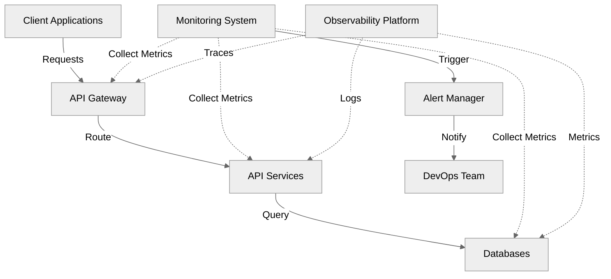

# Elevating API Resilience and Performance

## Advanced Monitoring and Observability

<div class="pt-12">
  <span class="text-xl">
    Luqman
    <div class="text-sm opacity-50">DevOps Engineer</div>
  </span>
</div>

<div class="abs-br m-6 flex gap-2">
  <a href="https://lu.ma/92yp3ytk" target="_blank" 
    class="text-xl opacity-50 !border-none !hover:text-white">
    API Connect
  </a>
</div>

---
layout: intro
---

# Setting the Stage

<v-clicks>

- 83% of web traffic is API traffic
- Average enterprise uses 900+ applications
- Every minute of downtime costs ~$5,600
- Modern challenges require modern solutions
- DevOps practices are crucial for API reliability

</v-clicks>

---
layout: default
---

# API Ecosystem Overview



---
layout: default
---

# Current Monitoring Challenges

<div grid="~ cols-2 gap-4">
<div>

## Scale Issues
<v-clicks>

- Microservices complexity
- Container orchestration
- Multi-cloud deployments
- Dynamic scaling

</v-clicks>

</div>
<div>

## Operational Challenges
<v-clicks>

- Alert fatigue
- Root cause analysis
- Service dependencies
- Resource optimization

</v-clicks>

</div>
</div>

---
layout: two-cols
---

# API Resilience Patterns

::left::

## Circuit Breakers
<v-clicks>

- Prevents cascade failures
- Auto-recovery
- Custom fallback strategies
- Health monitoring

</v-clicks>

::right::

## Implementation
```java
@CircuitBreaker(name = "userService",
    fallbackMethod = "userFallback",
    slidingWindowSize = 10,
    failureRateThreshold = 50,
    waitDurationInOpenState = 5000)
public User getUser(String id) {
    return userService.getUser(id);
}
```

---
layout: default
---

# Rate Limiting Strategies

```yaml
# API Gateway Configuration
rate-limiting:
  # Token Bucket Algorithm
  algorithms:
    token-bucket:
      rate: 100
      burst: 20
      replenish-rate: 10

  # Redis Implementation
  redis:
    host: redis-master
    port: 6379
    timeout: 2000

  # Response Headers
  headers:
    remaining: X-RateLimit-Remaining
    reset: X-RateLimit-Reset
    limit: X-RateLimit-Limit
```

---
layout: default
---

# Live Monitoring Demo

<div class="w-full flex justify-center">
  <APIMonitoringDemo />
</div>

---
layout: two-cols
---

# DevOps Integration

::left::

## CI/CD Pipeline
<v-clicks>

- Performance gates
- Automated testing
- Canary deployments
- Blue-green releases

</v-clicks>

::right::

## GitOps Practice
```yaml
apiVersion: argoproj.io/v1alpha1
kind: Application
metadata:
  name: monitoring-stack
spec:
  source:
    repoURL: https://github.com/org/monitoring
    path: kubernetes
    targetRevision: HEAD
  destination:
    server: https://kubernetes.default.svc
    namespace: monitoring
```

---
layout: default
---

# Kubernetes Monitoring Setup

```yaml
# Prometheus Operator
apiVersion: monitoring.coreos.com/v1
kind: ServiceMonitor
metadata:
  name: api-monitor
spec:
  selector:
    matchLabels:
      app: api-service
  endpoints:
  - port: http
    path: /metrics
    interval: 15s
    scrapeTimeout: 14s
    metricRelabelings:
    - sourceLabels: [__name__]
      regex: 'http_requests_total'
      action: keep
  namespaceSelector:
    matchNames:
    - production
    - staging
```

---
layout: default
---

# Alert Management

```yaml
groups:
- name: api.rules
  rules:
  - alert: HighErrorRate
    expr: |
      sum(rate(http_requests_total{status=~"5.."}[5m])) 
      / 
      sum(rate(http_requests_total[5m])) > 0.05
    for: 5m
    labels:
      severity: critical
    annotations:
      summary: High API Error Rate
      description: "Error rate is {{ $value }}%"
      runbook_url: "https://wiki.org/runbooks/high-error-rate"
```

---
layout: two-cols
---

# Performance Optimization

::left::

## Caching Strategy
```yaml
# Redis Configuration
maxmemory 2gb
maxmemory-policy allkeys-lru
replica-read-only yes
```

::right::

## Key Metrics
<v-clicks>

- Cache hit ratio
- Memory usage
- Eviction rate
- Connection pool

</v-clicks>

---
layout: default
---

# Auto-scaling Configuration

```yaml
# Horizontal Pod Autoscaling
apiVersion: autoscaling/v2
kind: HorizontalPodAutoscaler
metadata:
  name: api-hpa
spec:
  scaleTargetRef:
    apiVersion: apps/v1
    kind: Deployment
    name: api-service
  minReplicas: 3
  maxReplicas: 10
  metrics:
  - type: Resource
    resource:
      name: cpu
      target:
        type: Utilization
        averageUtilization: 70
  behavior:
    scaleDown:
      stabilizationWindowSeconds: 300
```

---
layout: section
---

# Incident Response & SRE Practices

<v-clicks>

1. Automated Remediation
2. Runbook Automation
3. Post-Mortem Process
4. SLO/SLI Management
5. Error Budget Policy

</v-clicks>

---
layout: default
---

# Automated Remediation

```python
def auto_remediate(incident):
    if incident.type == "HighLatency":
        # Scale up resources
        scale_deployment(
            namespace="production",
            deployment="api-service",
            replicas="+2"
        )
    elif incident.type == "HighErrorRate":
        # Implement circuit breaker
        enable_circuit_breaker(
            service="affected-service",
            threshold=0.5,
            timeout="30s"
        )
```

---
layout: two-cols
---

# Business Impact Analysis

::left::

## Cost Metrics
<v-clicks>

- Infrastructure costs
- Tool licensing
- Operation overhead
- Incident impact

</v-clicks>

::right::

## ROI Indicators
<v-clicks>

- Reduced MTTR
- Improved availability
- Customer satisfaction
- Resource efficiency

</v-clicks>

---
layout: center
class: text-center
---

# Q&A

Let's discuss your questions!

<div class="pt-8">
  <span class="px-2 py-1">
    Common Topics:
    - Tool selection strategy
    - Cost optimization
    - Scale challenges
    - Integration patterns
    - Team collaboration
  </span>
</div>

---
layout: end
---

# Thank You!

<div class="pt-12">
  <span @click="$slidev.nav.next" class="px-2 py-1 rounded cursor-pointer" hover="bg-white bg-opacity-10">
    Resources and Documentation Available
    - GitHub Repo: example/api-monitoring
    - Documentation: docs.example.com
    - Contact: @luqman
  </span>
</div>

<div class="abs-br m-6 flex gap-2">
  <a href="https://lu.ma/92yp3ytk" target="_blank" 
    class="text-xl opacity-50 !border-none !hover:text-white">
    API Connect
  </a>
</div>