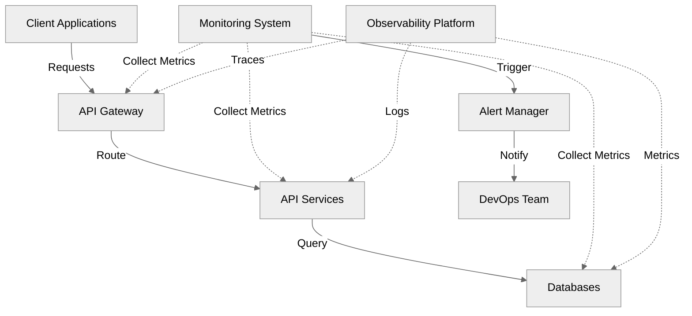
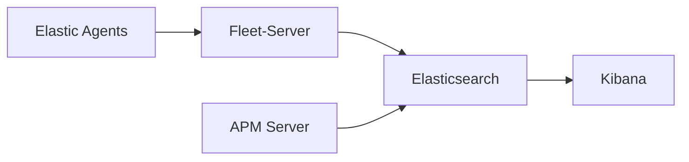

# Elevating API Resilience and Performance

## Advanced Monitoring and Observability

<!-- <div class="flex items-center justify-center">
  
</div> -->


<div class="abs-br m-6 flex gap-12">
  <a href="https://lu.ma/92yp3ytk" target="_blank" 
    class="text-xl opacity-50 !border-none !hover:text-white">
    API Connect
  </a>
</div>

<!--
Hello everyone! 

I'm Luqman Bello, a Senior DevOps Engineer at OpenBB with over 7 years of experience in IT Industry. 

Today's presentation draws from my experience in:
- Building and maintaining high-performance API infrastructures
- Implementing monitoring solutions at scale
- DevOps automation and tooling
- Cloud-native architectures

I've designed this session to be interactive and practical, focusing on real-world implementations and solutions. Feel free to ask questions throughout the presentation.

Key areas we'll explore:
- Modern API monitoring challenges
- Advanced observability techniques
- Implementation strategies
- Best practices from the field
-->

---
layout: text-image
media: "https://media.giphy.com/media/3oKIPEqDGUULpEU0aQ/giphy.gif"
---

# Setting the Stage

<v-clicks>

- 🌐 83% of web traffic is API traffic
- 🏢 Average enterprise uses 900+ applications
- ⚠️ $100K+ per hour of API downtime cost
- 🎯 200% annual increase in API security incidents
- 🔄 75% of organizations prioritize API monitoring

</v-clicks>

<v-clicks>

<div class="mt-4 text-sm text-gray-400">
Sources: Akamai, Salt Security Report 2023
</div>

</v-clicks>

<!--
Let me set the context for today's discussion:

- The 83% figure shows how APIs have become the backbone of modern digital infrastructure
- With 900+ applications in an average enterprise, the complexity of monitoring has increased exponentially
- Downtime costs aren't just financial - they impact reputation and customer trust
- Security incidents highlight the need for comprehensive monitoring
- Organizations are recognizing the critical nature of API monitoring

[The GIF on the right shows a dynamic visualization of network traffic, representing the complex nature of API interactions in modern systems]
-->

---
layout: default
---

# Why This Matters

<div grid="~ cols-2 gap-4">
<div>

<v-clicks>

## Business Impact

</v-clicks>

<v-clicks>

- 💰 Revenue loss from downtime
  - $100K+ per hour for large enterprises
- 😊 Customer satisfaction
  - 84% abandon apps after poor experience
- 🏢 Brand reputation
  - 60% switch providers after outage
- 🎯 Market competitiveness
  - 3x faster time-to-market with reliable APIs

</v-clicks>

</div>
<div>

<v-clicks>

## Technical Impact
</v-clicks>

<v-clicks>

- 🔄 System reliability
  - 99.9% uptime requirement
- ⚡ Performance bottlenecks
  - Sub-second response times
- 📊 Resource utilization
  - Optimal cost-performance ratio
- 👩‍💻 Developer productivity
  - 30% time saved with proper monitoring

</v-clicks>

</div>
</div>

<!--
This slide illustrates the dual impact of API performance:

Business Impact:
- Downtime directly affects revenue - companies lose an average of $100,000 per hour
- Customer satisfaction is closely tied to API performance
- Brand reputation can take months to recover after significant outages
- Market leaders consistently demonstrate better API reliability

Technical Impact:
- Modern systems require high availability and reliability
- Performance issues can cascade through interconnected services
- Proper monitoring helps optimize resource usage and costs
- Developers can focus on features rather than firefighting

The statistics help demonstrate the tangible effects of both good and poor API performance.
-->

---
layout: default
---

# API Ecosystem Overview



<!--
Let me walk you through our modern API ecosystem:

1. Client Layer: Where all requests originate, whether from user applications or external systems

2. Gateway Layer: Our first line of defense and traffic management
   - Handles routing, rate limiting, and initial request validation
   - Critical point for monitoring incoming traffic patterns

3. Service Layer: Where the actual business logic lives
   - Multiple microservices working together
   - Each service has its own monitoring requirements

4. Data Layer: The foundation of our system
   - Includes both databases and caching systems
   - Performance here affects the entire stack

5. Monitoring Layer: The nervous system of our infrastructure
   - Collects metrics from all other layers
   - Provides real-time visibility into system health
   - Enables proactive issue resolution

Notice how monitoring touches every layer - this is crucial for maintaining comprehensive observability.
-->


---
layout: default
---

# Current Monitoring Challenges

<div grid="~ cols-2 gap-4">
<div>

### Scale Issues
<v-clicks>


🔄 Microservices Complexity

🐳 Container Orchestration

☁️ Multi-cloud Deployments

📈 Dynamic Scaling s

</v-clicks>

</div>
<div>

### Operational Challenges
<v-clicks>


🚨 Alert Fatigue


🔍 Root Cause Analysis  

🔗 Service Dependencies

💰 Resource Optimization

</v-clicks>

</div>
</div>

<!--
Let's explore the major challenges in modern API monitoring:

Scale Issues:
- Microservices have transformed simple applications into complex distributed systems with hundreds of moving parts
- Container orchestration adds a dynamic layer that traditional monitoring can't handle
- (Cross-cloud monitoring, Different provider metrics, Unified dashboards) - Multi-cloud setups require sophisticated monitoring strategies to avoid blind spots
- Dynamic scaling makes it harder to establish normal baselines and predict resource needs

Operational Challenges:
- Alert fatigue is real: Teams receive hundreds of alerts daily and struggle to prioritize them
- Root cause analysis becomes complex in distributed systems with multiple failure points
- Understanding service dependencies is crucial for preventing cascading failures and ensuring system stability
- Resource optimization requires constant balancing of cost and performance, which is difficult without accurate monitoring data

Key Takeaway: Modern monitoring requires both sophisticated tooling and smart strategies to be effective.

[Note: Each challenge presented here will be addressed in subsequent sections with practical solutions]
-->

---
layout: text-window
---

### Monitoring Configuration Example

<div class="mb-4">

📌 Configuration shows typical monitoring setup for a critical service

🔍 Notice the multiple monitoring aspects:
 - Dependencies tracking
 - Alert thresholds
 - Performance metrics
 - Scaling rules

💡 This is just for one service - imagine managing hundreds!

</div>

::window::

```yaml
# Production monitoring configuration
service: payment-api
type: critical

dependencies:
  required:
    - auth-service
    - database-cluster
    - redis-cache
  optional:
    - analytics-service

monitoring:
  alerts:
    error_rate:
      threshold: "1%"
      window: "5m"
      severity: critical
      channels: 
        - slack-ops
        - pagerduty
    latency:
      p95: "200ms"
      p99: "500ms"
      severity: warning
  
  health_checks:
    - type: "http"
      endpoint: "/health"
      interval: "30s"
      timeout: "5s"
      failure_threshold: 3

  metrics:
    collect:
      - cpu_usage
      - memory_usage
      - request_rate
      - error_rate
      - response_time
    retention: "15d"
    resolution: "1m"

scaling:
  rules:
    - metric: cpu_usage
      threshold: "70%"
      duration: "5m"
    - metric: request_rate
      threshold: "1000/min"
      duration: "3m"
```
<!--
Let's examine a real-world monitoring configuration:

1. Service Dependencies
   - Clear definition of required vs optional dependencies
   - Helps in understanding failure impacts

2. Alert Configuration
   - Multiple severity levels
   - Different notification channels
   - Specific thresholds for different metrics

3. Health Checks
   - Regular service health monitoring
   - Configurable intervals and thresholds
   - Failure tolerance settings

4. Metric Collection
   - Key metrics are identified
   - Retention policies defined
   - Appropriate resolution for different needs

5. Scaling Rules
   - Multiple scaling triggers
   - Threshold-based scaling
   - Time-based evaluation

This configuration demonstrates the complexity of modern service monitoring and the need for comprehensive observability strategies.
-->

---
layout: image-right
image: 'logos.svg' # This would be your collage of logos
---

# Modern Monitoring Tools

<v-clicks>

## Industry-Leading Solutions

Various tools cater to different monitoring needs:

- 🔷 Application Performance Monitoring (APM)
- 🔶 Infrastructure Monitoring
- 🔹 Log Management
- 🔸 Metrics & Analytics
- 💠 Distributed Tracing
- 🔷 Real-time Alerting

</v-clicks>

<!--
Before we dive into specific tools, let's understand the landscape:

- These tools represent the backbone of modern monitoring
- Each category serves a specific monitoring need
- Many organizations use a combination of these tools
- Selection depends on specific use cases and scale

The image shows the most popular tools in the monitoring space, which we'll discuss in detail next.
-->

---
layout: two-cols
---

# Modern Monitoring Stack


## Datadog & NewRelic
<v-clicks>

📊 Real-time performance monitoring
  
🔍 APM capabilities

  
🖥️ Infrastructure monitoring
  
📈 Advanced Analytics


</v-clicks>

::right::

## Prometheus & Grafana
<v-clicks>

- ⏱️ Time-series data collection
  - High-resolution metrics
  - Long-term data retention
  
- 🎯 Custom metrics
  - Rich query language (PromQL)
  - Multi-dimensional data model
  
- ⚡ Alerting capabilities
  - Complex alert conditions
  - Alert aggregation
  - Multiple notification channels
  
- 📊 Visualization excellence
  - Custom dashboards
  - Real-time updates
  - Template variables

</v-clicks>

<!--
Let's compare these powerful monitoring solutions:

Commercial Solutions (Datadog & NewRelic):
- Provide comprehensive, out-of-box monitoring
- Require minimal setup but higher cost
- Great for teams needing quick implementation
- Strong support and integration options

Open Source Stack (Prometheus & Grafana):
- Highly customizable and cost-effective
- Requires more initial setup and maintenance
- Great for teams needing full control
- Strong community support

Both approaches have their place, and many organizations use a combination depending on specific needs.

Key Takeaway: Choose tools based on your team's expertise, budget, and specific monitoring requirements.
-->

---
layout: default
---

# Modern Monitoring Stack

<div grid="~ cols-2 gap-4">
<div>

## Datadog & NewRelic
<v-clicks>

- Real-time performance monitoring
- APM capabilities
- Infrastructure monitoring
- Custom metrics
- Transaction tracing
- Error tracking

</v-clicks>

</div>
<div>

## Prometheus & Grafana
<v-clicks>

- Time-series data collection
- Custom metrics
- Alerting capabilities
- Visualization excellence
- PromQL flexibility
- Dashboard templates
- Open-source community

</v-clicks>

</div>
</div>

<!--
Testing
-->

---
layout: default
---

# Elastic Stack Deep Dive



<v-clicks>

- Log aggregation and analysis
- Full-text search capabilities
- Anomaly detection
- Visual data exploration
- Real-time monitoring
- Custom dashboards

</v-clicks>

---
layout: default
---

# PostHog Integration

<div grid="~ cols-2 gap-4">
<div>

<v-clicks>

## Analytics Features
- User behavior tracking
- Feature flag management
- Session recording
- Product analytics
- A/B testing

</v-clicks>

</div>
<div>

<v-clicks>

## Benefits
- Data-driven decisions
- User-centric monitoring
- Feature impact analysis
- Conversion tracking
- Engagement metrics

</v-clicks>
</div>
</div>

---
layout: default
---

# Live Monitoring Demo

<div class="w-full flex justify-center">
  <APIMonitoringDemo />
</div>

---
layout: two-cols
---

# API Resilience Patterns


## Circuit Breakers
<v-clicks>

- Prevents cascade failures
- Auto-recovery
- Custom fallback strategies
- Health monitoring

</v-clicks>

::right::

## Implementation
```java
@CircuitBreaker(name = "userService",
    fallbackMethod = "userFallback",
    slidingWindowSize = 10,
    failureRateThreshold = 50,
    waitDurationInOpenState = 5000)
public User getUser(String id) {
    return userService.getUser(id);
}
```

---
layout: default
---

# Rate Limiting Strategies

```yaml
# API Gateway Configuration
rate-limiting:
  # Token Bucket Algorithm
  algorithms:
    token-bucket:
      rate: 100
      burst: 20
      replenish-rate: 10

  # Redis Implementation
  redis:
    host: redis-master
    port: 6379
    timeout: 2000

  # Response Headers
  headers:
    remaining: X-RateLimit-Remaining
    reset: X-RateLimit-Reset
    limit: X-RateLimit-Limit
```

---
layout: two-cols
---

# Implementation Best Practices


## Core Principles
<v-clicks>

1. **Start with Objectives**
   - Define clear goals
   - Align with stakeholders
   - Set measurable targets

2. **Define Standards**
   - SLIs (Service Level Indicators)
   - SLOs (Service Level Objectives)
   - SLAs (Service Level Agreements)

</v-clicks>

::right::

## Technical Approach
<v-clicks>

1. **Implementation Steps**
   - Proper tagging strategy
   - Meaningful dashboards
   - Intelligent alerting
   - Automation first

2. **Validation Process**
   - Performance testing
   - Chaos engineering
   - Continuous validation
   - Feedback loops

</v-clicks>

---
layout: default
---

# DevOps Integration

```yaml
# ArgoCD Application Configuration
apiVersion: argoproj.io/v1alpha1
kind: Application
metadata:
  name: monitoring-stack
spec:
  source:
    repoURL: https://github.com/org/monitoring
    path: kubernetes
    targetRevision: HEAD
  destination:
    server: https://kubernetes.default.svc
    namespace: monitoring
```

---
layout: default
---

# Kubernetes Monitoring Setup

```yaml
# Prometheus Operator
apiVersion: monitoring.coreos.com/v1
kind: ServiceMonitor
metadata:
  name: api-monitor
spec:
  selector:
    matchLabels:
      app: api-service
  endpoints:
  - port: http
    path: /metrics
    interval: 15s
    scrapeTimeout: 14s
    metricRelabelings:
    - sourceLabels: [__name__]
      regex: 'http_requests_total'
      action: keep
```

---
layout: default
---

# Alert Management

```yaml
groups:
- name: api.rules
  rules:
  - alert: HighErrorRate
    expr: |
      sum(rate(http_requests_total{status=~"5.."}[5m])) 
      / 
      sum(rate(http_requests_total[5m])) > 0.05
    for: 5m
    labels:
      severity: critical
    annotations:
      summary: High API Error Rate
      description: "Error rate is {{ $value }}%"
      runbook_url: "https://wiki.org/runbooks/high-error-rate"
```

---
layout: default
---

# Real-World Case Study

<div grid="~ cols-2 gap-4">
<div>

## Initial State
- 99.5% availability
- 500ms response time
- 1% error rate
- Manual scaling

</div>
<div>

## After Implementation
- 99.99% availability
- 150ms response time
- 0.1% error rate
- Auto-scaling enabled

</div>
</div>

<v-clicks>

## Key Learnings
- Importance of baseline metrics
- Value of automated responses
- Need for proper monitoring
- Cost vs. performance balance

</v-clicks>

---
layout: default
---

# Auto-scaling Configuration

```yaml
# Horizontal Pod Autoscaling
apiVersion: autoscaling/v2
kind: HorizontalPodAutoscaler
metadata:
  name: api-hpa
spec:
  scaleTargetRef:
    apiVersion: apps/v1
    kind: Deployment
    name: api-service
  minReplicas: 3
  maxReplicas: 10
  metrics:
  - type: Resource
    resource:
      name: cpu
      target:
        type: Utilization
        averageUtilization: 70
```

---
layout: section
---

# Incident Response & SRE Practices

<v-clicks>

1. Automated Remediation
2. Runbook Automation
3. Post-Mortem Process
4. SLO/SLI Management
5. Error Budget Policy

</v-clicks>

---
layout: default
---

# Automated Remediation

```python
def auto_remediate(incident):
    if incident.type == "HighLatency":
        # Scale up resources
        scale_deployment(
            namespace="production",
            deployment="api-service",
            replicas="+2"
        )
    elif incident.type == "HighErrorRate":
        # Implement circuit breaker
        enable_circuit_breaker(
            service="affected-service",
            threshold=0.5,
            timeout="30s"
        )
```

---
layout: two-cols
---

# Business Impact Analysis


## Cost Metrics
<v-clicks>

- Infrastructure costs
- Tool licensing
- Operation overhead
- Incident impact

</v-clicks>

::right::

## ROI Indicators
<v-clicks>

- Reduced MTTR
- Improved availability
- Customer satisfaction
- Resource efficiency

</v-clicks>

---
layout: center
class: text-center
---

# Q&A

Let's discuss your questions!

<div class="pt-8">
  <span class="px-2 py-1">
    Common Topics:
    - Tool selection strategy
    - Cost optimization
    - Scale challenges
    - Integration patterns
    - Team collaboration
  </span>
</div>

---
layout: end
---

# Thank You!

<div class="pt-12">
  <span @click="$slidev.nav.next" class="px-2 py-1 rounded cursor-pointer" hover="bg-white bg-opacity-10">
    Resources and Documentation Available
    - GitHub Repo: example/api-monitoring
    - Documentation: docs.example.com
    - Contact: @luqman
  </span>
</div>

<div class="abs-br m-6 flex gap-2">
  <a href="https://lu.ma/92yp3ytk" target="_blank" 
    class="text-xl opacity-50 !border-none !hover:text-white">
    API Connect
  </a>
</div>
